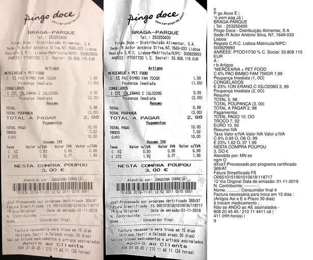

# Invoice scanner

This project is the result of a hackathon whose objective was to create a system that would extract data from invoice photos (products bought, supermarket, prices, etc) and display the extracted data in a dashboard.

## Scanning the invoices

To detect the text on the invoice photos we relied on [tesseract](https://github.com/tesseract-ocr/tesseract) and imagemagick to improve the quality of the photos by cropping the image, reducing the brightness, increasing the contrast, reducing to a gray colorspace and sharpening the edges.

The main issue in this step was the fact that the invoices we had on us at the time were already old and battered, as well as the fact that tesseract was trained on books.

  

